<div align="center">

# 国庆 7 天连更海报生成器

**一句话，把「主体 + 日期」变成一套可直接出图的 9:16 红金国风国庆海报。**

2026 · 中华人民共和国成立 77 周年｜栏目数 = 日期号｜Day7 三角交错特殊版式｜画框内零文字

[作品示例](#作品示例) · [功能](#功能) · [安装](#安装) · [用法](#用法) · [出图](#出图) · [目录结构](#目录结构) · [免责声明](#免责声明)

</div>

---

## 作品示例

10.1 → 10.7 每日一张，**栏目数 = 日期号**（1 号 1 栏 → 7 号 7 栏），10.7 为三角交错特殊版式，也可换成北斗七星 / 七竖条等形状版式。以下六套都是本地浏览器引擎 + 实景参考图的**实际出图效果**（未做后期修图）。

<details open>
<summary><strong>① 中国</strong>　内置 28 条 2026 重大工程 / 科技成就素材库，无需联网检索</summary>

<table>
  <tr>
    <td align="center" width="33%"><strong>10.1 · 1 栏</strong><br><br>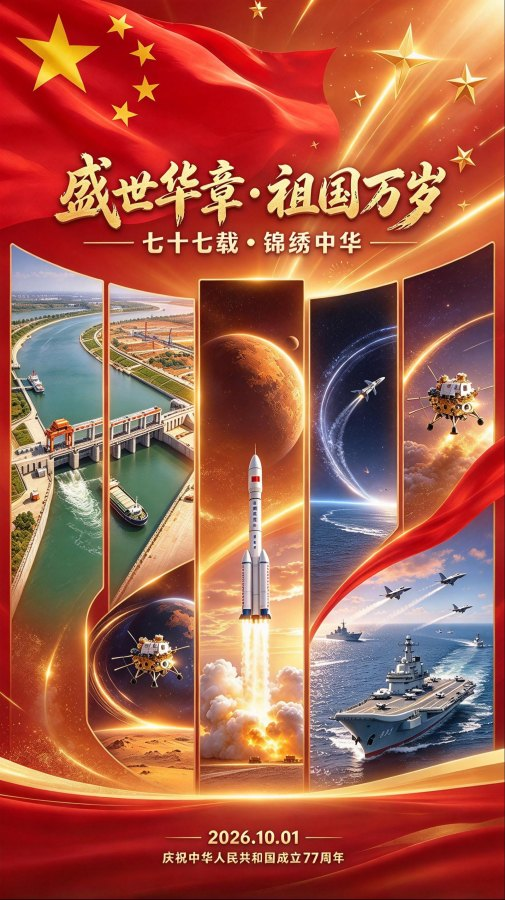</td>
    <td align="center" width="33%"><strong>10.2 · 2 栏</strong><br><br></td>
    <td align="center" width="33%"><strong>10.3 · 3 栏</strong><br><br>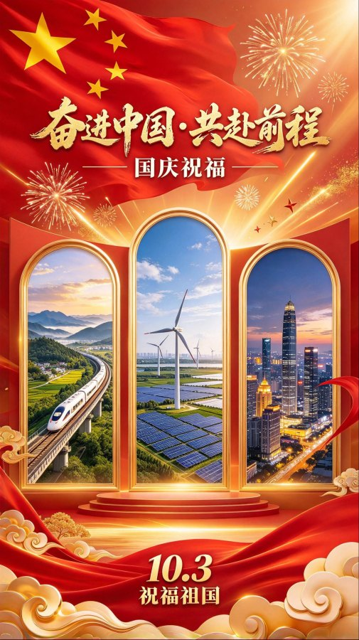</td>
  </tr>
  <tr>
    <td align="center"><strong>10.4 · 4 栏</strong><br><br>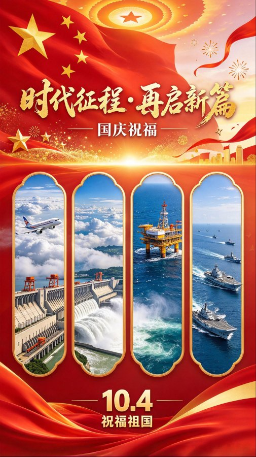</td>
    <td align="center"><strong>10.5 · 5 栏</strong><br><br>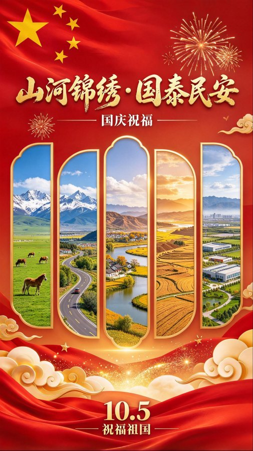</td>
    <td align="center"><strong>10.6 · 6 栏</strong><br><br>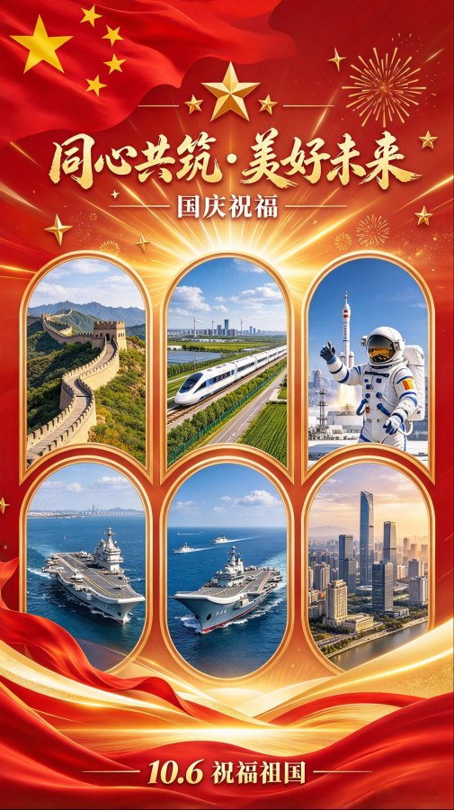</td>
  </tr>
  <tr>
    <td align="center"><strong>10.7 · 7 栏三角交错</strong><br><br>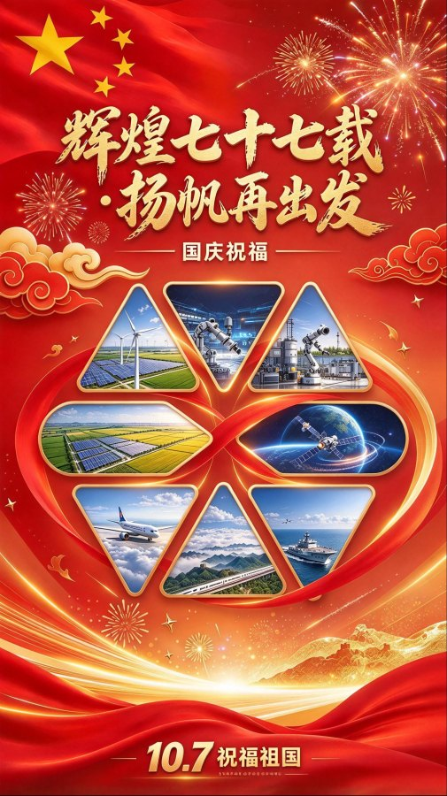</td>
    <td colspan="2" align="left" valign="top">
      <br>
      <ul>
        <li>画框内部零文字，画外仅有主标题、副标题与落款</li>
        <li>主标题与落款按天可换，见 <code>config/events_national.json</code> 的 <code>title</code> / <code>signature</code></li>
      </ul>
    </td>
  </tr>
</table>

</details>

<details>
<summary><strong>② 上海</strong>　城市主题：联网检索地标与城市成就素材后生成</summary>

<table>
  <tr>
    <td align="center" width="33%"><strong>10.1 · 1 栏</strong><br><br></td>
    <td align="center" width="33%"><strong>10.2 · 2 栏</strong><br><br>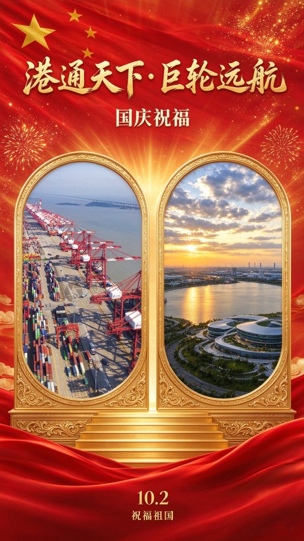</td>
    <td align="center" width="33%"><strong>10.3 · 3 栏</strong><br><br></td>
  </tr>
  <tr>
    <td align="center"><strong>10.4 · 4 栏</strong><br><br>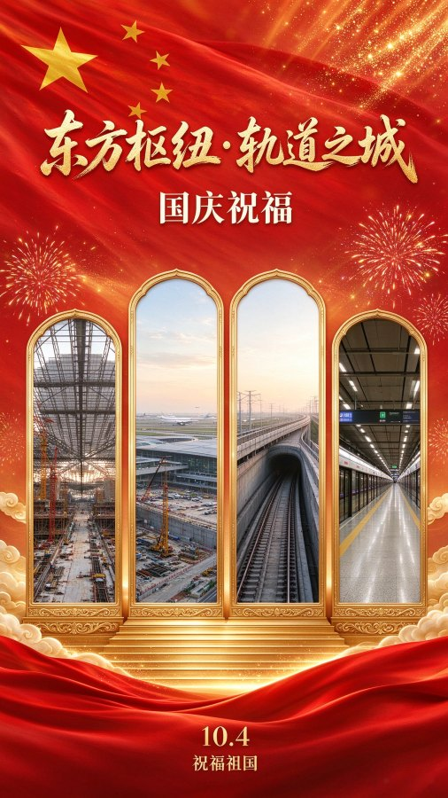</td>
    <td align="center"><strong>10.5 · 5 栏</strong><br><br>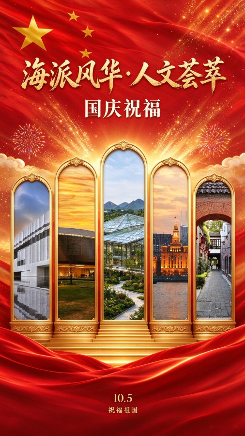</td>
    <td align="center"><strong>10.6 · 6 栏</strong><br><br>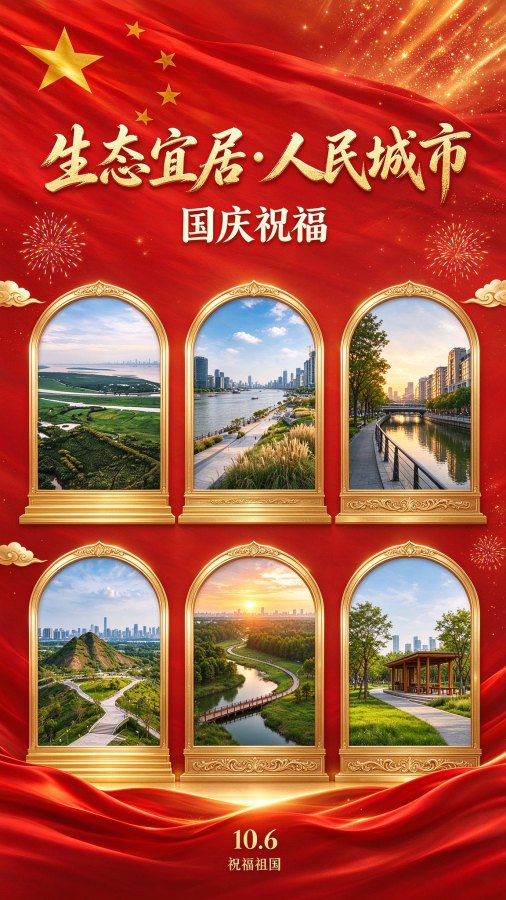</td>
  </tr>
  <tr>
    <td align="center"><strong>10.7 · 7 栏三角交错</strong><br><br>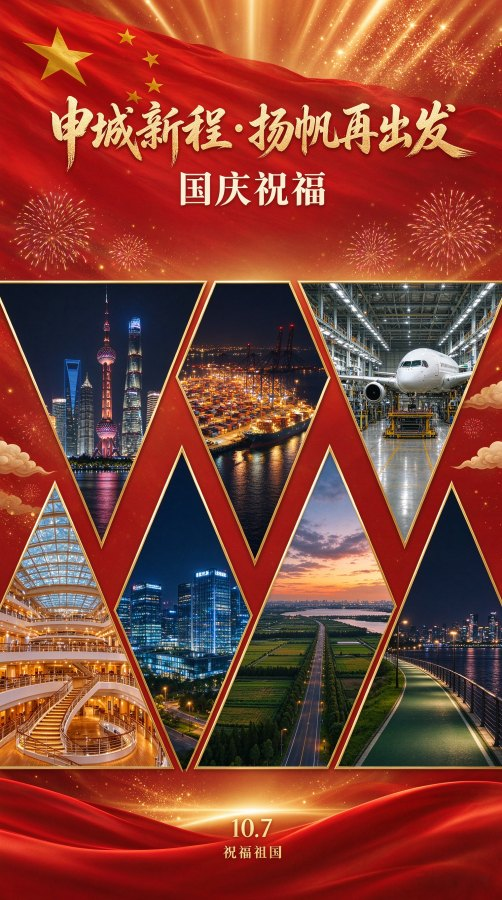</td>
    <td colspan="2" align="left" valign="top">
      <br>
      <ul>
        <li>素材库：<code>config/subjects/上海.json</code>（7 大主题 × 4 条）</li>
        <li>需要二维码 / 机构署名时出图后再叠加，默认不加</li>
      </ul>
    </td>
  </tr>
</table>

</details>

<details>
<summary><strong>③ 重庆大学</strong>　高校主题：按校区地标、学科与科研平台检索素材</summary>

<table>
  <tr>
    <td align="center" width="33%"><strong>10.1 · 1 栏</strong><br><br></td>
    <td align="center" width="33%"><strong>10.2 · 2 栏</strong><br><br>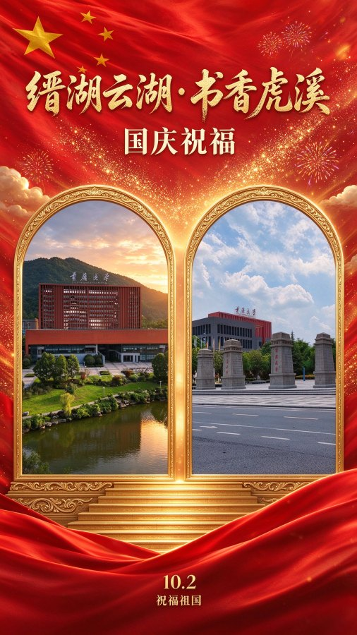</td>
    <td align="center" width="33%"><strong>10.3 · 3 栏</strong><br><br>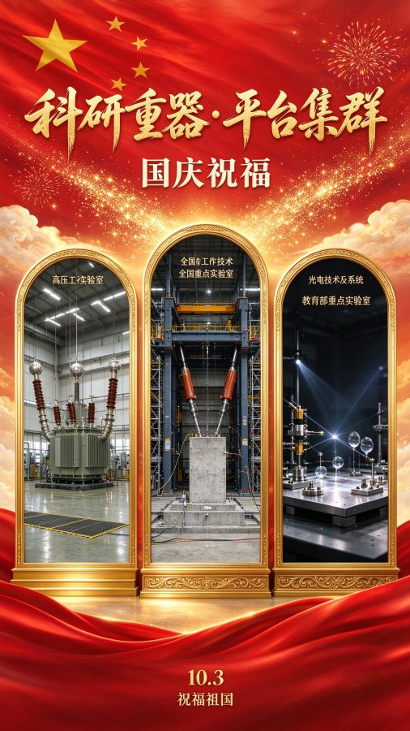</td>
  </tr>
  <tr>
    <td align="center"><strong>10.4 · 4 栏</strong><br><br>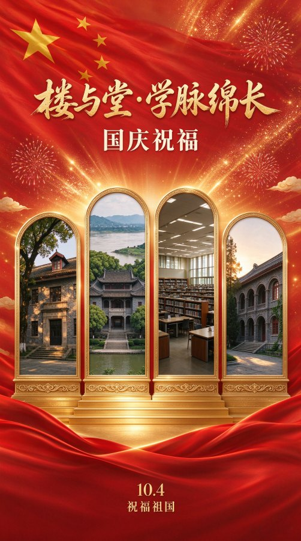</td>
    <td align="center"><strong>10.5 · 5 栏</strong><br><br>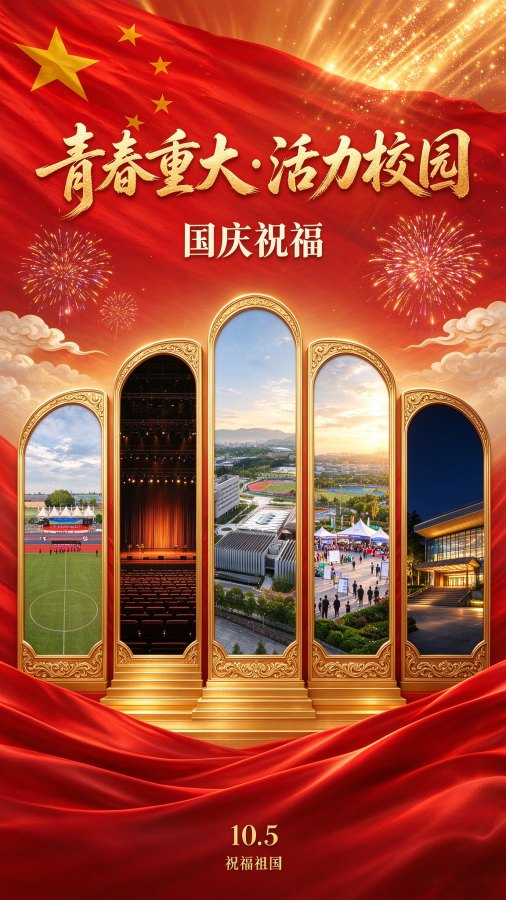</td>
    <td align="center"><strong>10.6 · 6 栏</strong><br><br>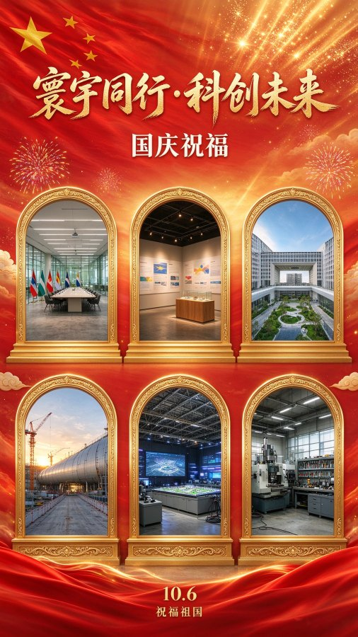</td>
  </tr>
  <tr>
    <td align="center"><strong>10.7 · 7 栏三角交错</strong><br><br></td>
    <td colspan="2" align="left" valign="top">
      <br>
      <ul>
        <li>素材库：<code>config/subjects/重庆大学.json</code>（7 大主题 × 4 条）</li>
        <li>高校主体不精确复刻校徽与商标，人物仅作远景氛围</li>
      </ul>
    </td>
  </tr>
</table>

</details>

<details>
<summary><strong>④ 泉州</strong>　城市主题：世遗地标 + 非遗人文 + 智造产业 + 两江夜景，28 条素材 / 225 张实景参考图</summary>

<table>
  <tr>
    <td align="center" width="33%"><strong>10.1 · 1 栏</strong><br><br></td>
    <td align="center" width="33%"><strong>10.2 · 2 栏</strong><br><br>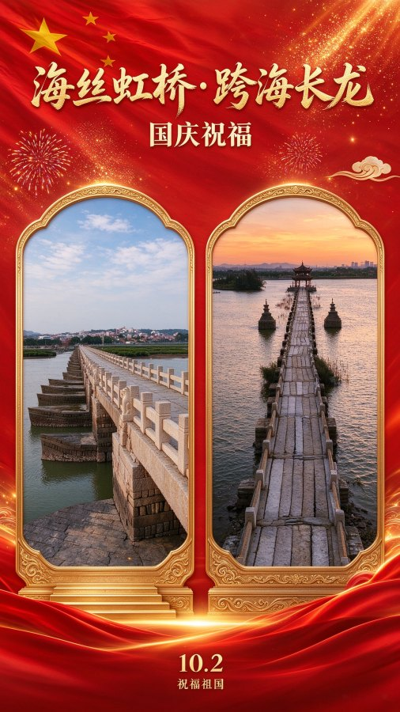</td>
    <td align="center" width="33%"><strong>10.3 · 3 栏</strong><br><br>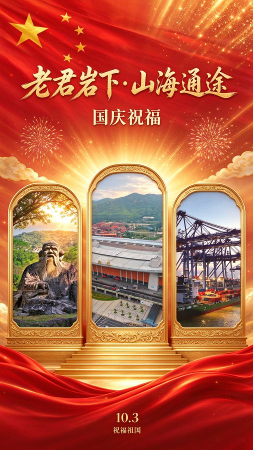</td>
  </tr>
  <tr>
    <td align="center"><strong>10.4 · 4 栏</strong><br><br>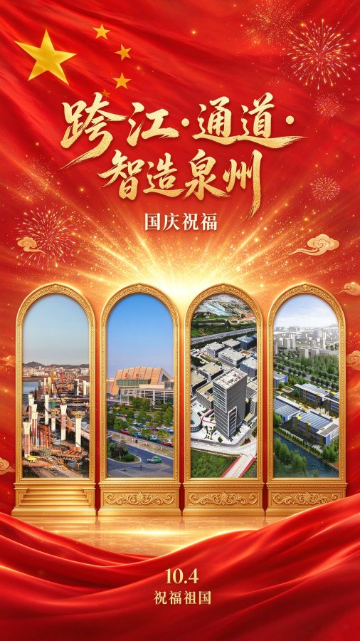</td>
    <td align="center"><strong>10.5 · 5 栏</strong><br><br></td>
    <td align="center"><strong>10.6 · 6 栏</strong><br><br></td>
  </tr>
  <tr>
    <td align="center"><strong>10.7 · 7 栏三角交错</strong><br><br></td>
    <td colspan="2" align="left" valign="top">
      <br>
      <ul>
        <li>素材库：<code>config/subjects/泉州.json</code>（地标 / 工程 / 产业 / 生态 / 非遗 / 民生 / 夜景 各 4 条）</li>
        <li>实景参考图：<code>config/refs_泉州.json</code>，28 个题材采集 225 张，按题材贴合 + 画质 + 来源评分，低于 4 分不采用</li>
        <li>非遗与市井题材不出现可识别人物面部，不出现品牌与可读店招文字</li>
      </ul>
    </td>
  </tr>
</table>

</details>

<details>
<summary><strong>⑤ 泉州·照片直排版</strong>　同一套素材，改用 <code>compose</code> 直排：达标实景照片直接落位，不再交给模型参考生成</summary>

<table>
  <tr>
    <td align="center" width="33%"><strong>10.1 · 单框拱门</strong><br><br>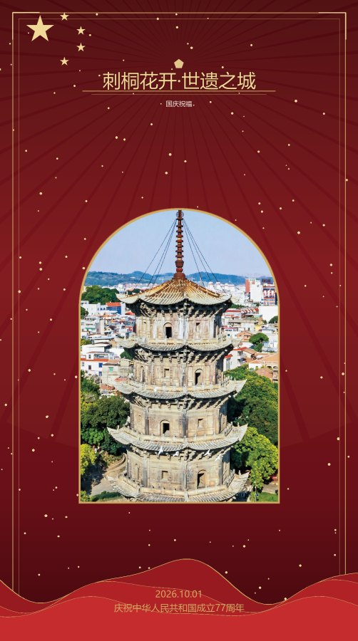</td>
    <td align="center" width="33%"><strong>10.2 · 双框并立</strong><br><br>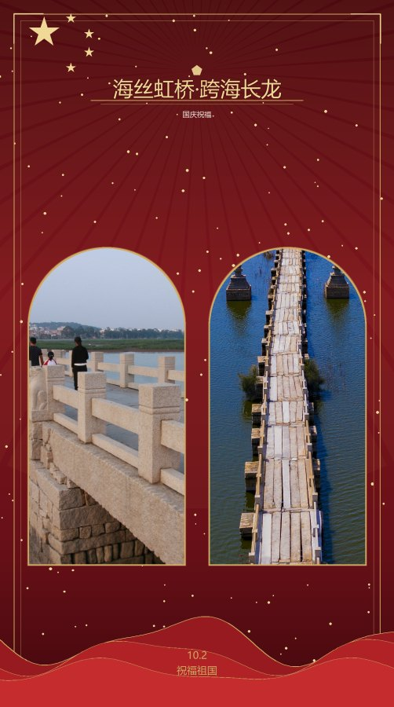</td>
    <td align="center" width="33%"><strong>10.3 · 三框拱起</strong><br><br>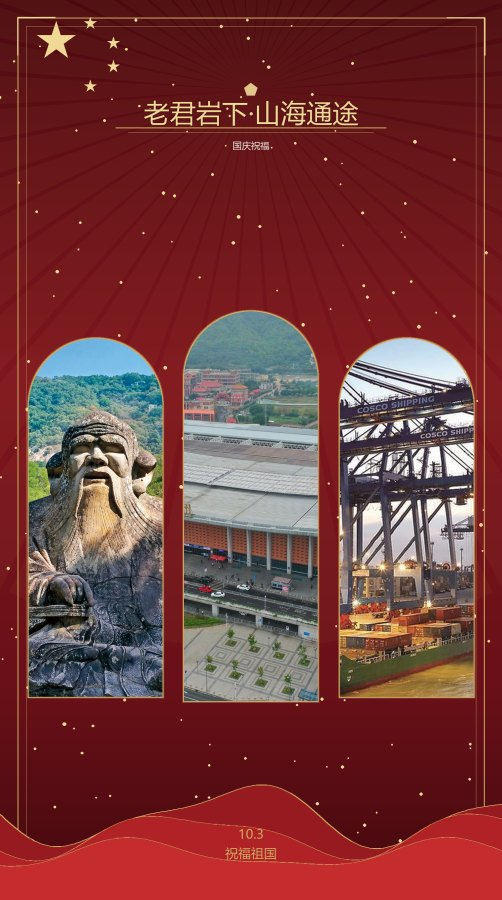</td>
  </tr>
  <tr>
    <td align="center"><strong>10.4 · 四联拱</strong><br><br>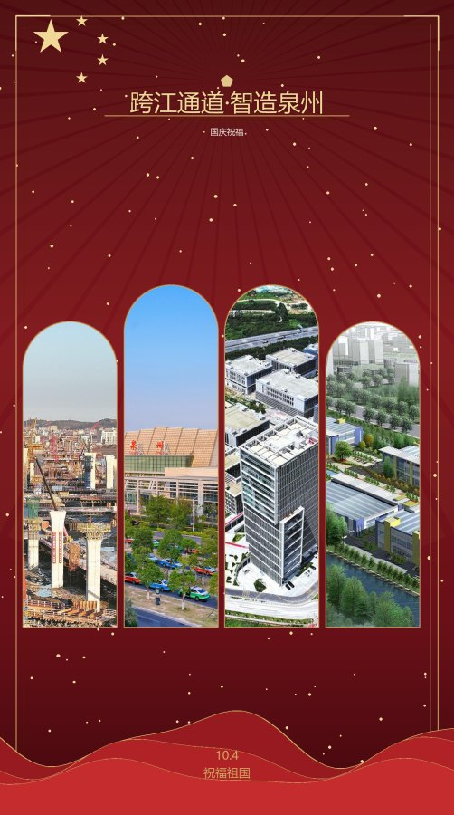</td>
    <td align="center"><strong>10.5 · 五角星阵</strong><br><br></td>
    <td align="center"><strong>10.6 · 六瓣花</strong><br><br>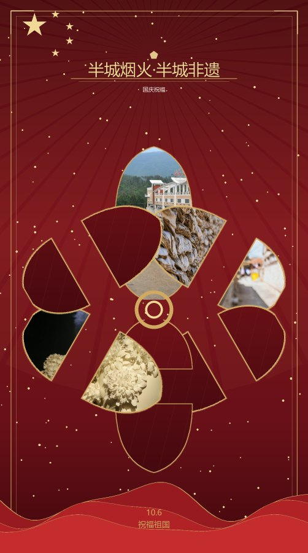</td>
  </tr>
  <tr>
    <td align="center"><strong>10.7 · 三角交错</strong><br><br></td>
    <td colspan="2" align="left" valign="top">
      <br>
      <ul>
        <li>命令：<code>python scripts/nd7.py compose --subject 泉州 --all</code>，产物在 <code>outputs/泉州/compose/</code></li>
        <li>每个画框挑该题材评分最高的实景照片；≥9 分会在日志里标注「优秀·直接采用」，未达 <code>--min-score</code>（默认 5.0）的栏目画金色留空框</li>
        <li>人物场景题材（素材库标 <code>people: true</code>）默认不采用实拍照片，避免可识别人物面部</li>
        <li>与上方 ④ 是同一套素材、两种出法，便于对比挑用</li>
      </ul>
    </td>
  </tr>
</table>

</details>

<details>
<summary><strong>⑥ 福州</strong>　城市主题：两江四岸 + 船政非遗 + 数字福州，5 / 6 / 7 栏改用形状版式（五角星阵 / 六瓣花 / 北斗七星）</summary>

<table>
  <tr>
    <td align="center" width="33%"><strong>10.1 · 1 栏</strong><br><br>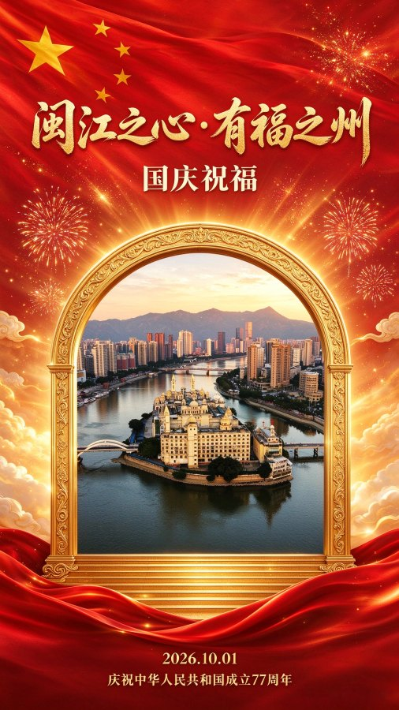</td>
    <td align="center" width="33%"><strong>10.2 · 2 栏</strong><br><br></td>
    <td align="center" width="33%"><strong>10.3 · 3 栏</strong><br><br>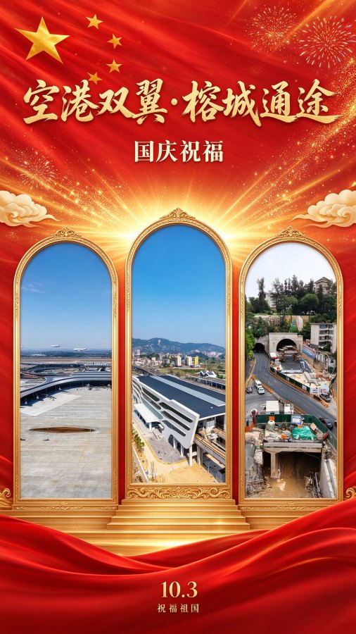</td>
  </tr>
  <tr>
    <td align="center"><strong>10.4 · 4 栏</strong><br><br>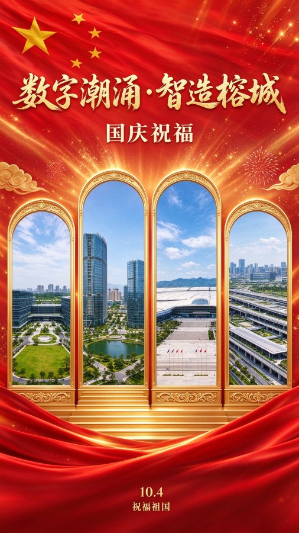</td>
    <td align="center"><strong>10.5 · 五角星阵</strong><br><br>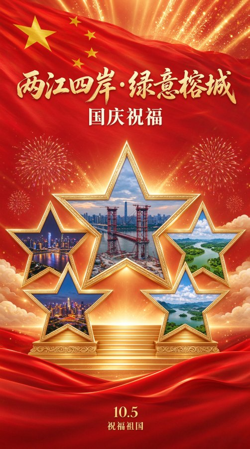</td>
    <td align="center"><strong>10.6 · 六瓣花</strong><br><br>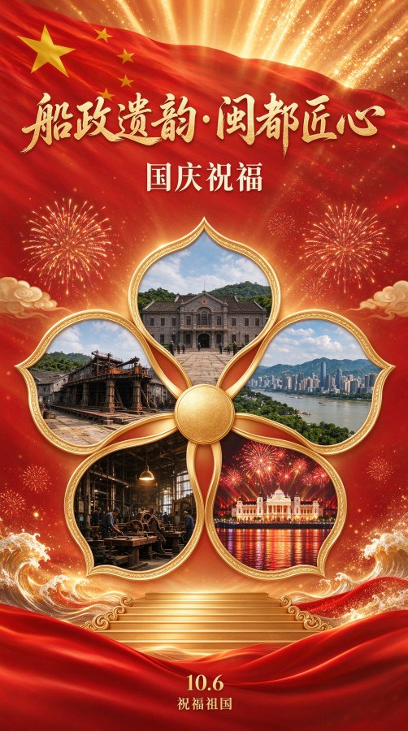</td>
  </tr>
  <tr>
    <td align="center"><strong>10.7 · 北斗七星</strong><br><br></td>
    <td colspan="2" align="left" valign="top">
      <br>
      <ul>
        <li>素材库：<code>config/subjects/福州.json</code>（地标 / 工程 / 产业 / 生态 / 非遗 / 民生 / 夜景 各 4 条，共 28 条）</li>
        <li>采集配置：<code>config/refs_福州.json</code>，28 个题材共 204 张实景参考图；1–4 天带参考图出图，5–7 天指定形状版式</li>
        <li>版式：<code>--layout five-star / six-petal / seven-dipper</code>，与照片直排共用 <code>config/frames.json</code> 同一份定义</li>
      </ul>
    </td>
  </tr>
</table>

</details>

---

## 使用注意事项（先看这里）

1. **必须先在浏览器里登录一次**：用**本机 Chrome 或 Edge** 打开 [豆包](https://www.doubao.com)（千问 / 即梦同理）完成登录，再运行脚本。浏览器引擎是复用登录态出图的，没有登录态提交不会成功。
2. **Chrome 136+ 限制**：新版 Chrome 禁止在默认用户数据目录上开启远程调试，脚本会自动把用户数据复制成「登录态副本」（首次约数十秒，之后增量复用）。所以**运行前请先完全退出 Chrome/Edge**；若日志提示未登录，回到原浏览器登录一次再重跑。
3. **出图耗时**：纯文生图约 1 分钟/张，带实景参考图（图生图）约 2–3 分钟/张。跑 7 天全套请给到 `--timeout 300`，中途不要关闭弹出的浏览器窗口。
4. **平台角标水印**：豆包等会在成图右下角加「xx AI 生成」角标，出图后默认自动清除（`--no-clean` 可关闭）。
5. **合规**：不生成可识别的真实人物肖像，不精确复刻校徽与商标，不使用绝对化宣传用语；实景参考照片仅取公开可检索来源并记录出处，对外发布前请自行确认版权与肖像权。

---

## 功能

- **7 天连更**：10.1 → 10.7 每天一张，栏目数随日期递增（1、2、3、4、5、6、7 栏）
- **特殊版式**：Day7 上排 3 个倒三角 + 下排 4 个正三角，金色细框交错咬合
- **每日可换文案**：主标题与两行落款按天配置（如 10.1「盛世华章·祖国万岁」、10.7「辉煌七十七载·扬帆再出发」）
- **三类主体**
  - 国家（默认）：内置 28 条 2026 重大工程 / 科技事件素材库（平陆运河、可复用火箭、天问二号、C919、深海一号、航母编队……）
  - 城市 / 学校 / 企业：先联网检索公开素材，落地为素材库 JSON 后再生成
- **可选项**：二维码、机构/公司署名，默认不加，生成前会主动提醒；二维码在出图后叠加真实可扫描图案，不让 AI 画乱码方块
- **两种出图引擎**：API（SiliconFlow / 通义万相 / OpenAI 兼容）；本地浏览器复用豆包、千问、即梦的登录态（按 Chrome → Edge 顺序查找）
- **画框内零文字**：正面提示词只描述画面，画外文字仅保留主标题、副标题、落款与用户确认的署名

## 安装

```powershell
pip install -r requirements.txt          # Pillow + segno（二维码）
pip install playwright                   # 可选：用本地浏览器出图（无需下载浏览器）

git clone https://github.com/haierzld/NationalDay7DaysPoster.git
```

作为 Agent Skill 使用时，把仓库放到对应 Skills 目录（例如 CodeBuddy：`%USERPROFILE%\.codebuddy\skills\`，TRAE：`%USERPROFILE%\.trae\skills\`），或在项目内使用 `.codebuddy\skills\`。

## 用法

```powershell
# 1. 解析主体（中国 / 中国福州 / 某某大学 / 某某集团）
python scripts/nd7.py subject "中国福州"

# 2. 生成提示词
python scripts/nd7.py prompt --day 7
python scripts/nd7.py plan --subject 中国 --out outputs/prompts.md

# 3. 出图（默认输出到 outputs/<主体>/dayN.png）
python scripts/nd7.py gen --day 1 --engine api --provider siliconflow
python scripts/nd7.py gen --all --engine browser --platform doubao
# 指定形状版式（5/6/7 栏可选五角星、五边形、六花瓣、蜂巢环、七竖条、倒三角+菱形、北斗七星）
python scripts/nd7.py gen --day 7 --subject 泉州 --layout seven-dipper --engine browser --platform doubao

# 4. 实景照片直排：网图评分达标就不再让模型参考生成，直接把照片排进画框
python scripts/nd7.py compose --list-layouts                      # 看有哪些形状版式
python scripts/nd7.py compose --subject 泉州 --day 5 --layout five-star
python scripts/nd7.py compose --subject 泉州 --all                # 输出到 outputs/泉州/compose/dayN.png

# 5. 二维码 / 署名叠加
python scripts/nd7.py overlay --image "outputs/泉州/day*.png" --qr "https://example.com" --org "某某集团" --date 2026.10.01
```

### 城市 / 学校 / 企业示例

```powershell
python scripts/nd7.py subject "福州大学"          # 得到 7 大主题与合规提醒
# 按主题联网检索 28 个条目 → 写入 config/subjects/福州大学.json
python scripts/nd7.py plan --subject "福州大学" --out outputs/福州大学-prompts.md
```

检索规范与 JSON 格式见 [`reference/subject-playbook.md`](reference/subject-playbook.md)。

## 出图

| 引擎 | 命令 | 说明 |
| --- | --- | --- |
| API | `--engine api --provider siliconflow\|dashscope\|openai` | 用 `SILICONFLOW_API_KEY` / `DASHSCOPE_API_KEY` / `OPENAI_API_KEY` 或 `--api-key` |
| 本地浏览器 | `--engine browser --platform doubao\|qianwen\|jimeng` | 复用本机 Chrome / Edge 的登录态，无需 Key |

浏览器引擎会按 **Chrome → Edge** 顺序找到本机浏览器，把用户数据复制成**登录态副本**（Chrome 136+ 禁止在默认用户数据目录上开启远程调试），进入图像生成模式后自动填提示词并发送，最后轮询下载图片；定位失败时会把提示词复制到剪贴板，等你手动粘贴发送后继续自动下载。

前提：在原浏览器里已登录豆包 / 千问 / 即梦。想先看看会提交什么，可加 `--dry-run`。

```powershell
python scripts/nd7.py gen --day 1 --engine browser --platform doubao --dry-run
python scripts/nd7.py browsers          # 只探测本机浏览器
```

详见 [`reference/generation-guide.md`](reference/generation-guide.md)。

## 平台角标水印

豆包 / 即梦等会在成图右下角加「xx AI 生成」角标。浏览器引擎出图后**默认自动清除**（`--no-clean` 关闭）：
四角外缘检测浅色小字 → 掩码 → `cv2.inpaint` 用邻域背景重建。

```powershell
python scripts/nd7.py wm --image "outputs/day?_安溪.png" --detect --dump-dir outputs/_wm_cand
python scripts/nd7.py wm --image "outputs/day*_中国.png"        # 输出 *_clean.png
python scripts/nd7.py wm --image "outputs/day?.png" --inplace   # 就地覆盖
python scripts/nd7.py wm --image "outputs/day1.png" --force --default-box 0.80,0.962,0.20,0.036 --inplace
```

## 实景优先：抓真实照片再出图

地标类题材（古建筑、景区、校园、厂区）不靠提示词臆造，先抓公开的真实照片，再上传给平台作为参考图：

```powershell
# 1. 采集（检索词 = 地点 + 标志性特征）
python scripts/nd7.py refs --config config/refs_安溪.json
#   → assets/安溪/<slug>/01_xxx.jpg   +   assets/安溪/_refs.json（来源清单）
python scripts/nd7.py refs --query "安溪清水岩 帝字形 主殿 蓬莱山" --slug qingshuiyan --limit 8

# 2. 携带照片出图（图生图，约 2-3 分钟/张）
python scripts/nd7.py gen --day 2 --subject 安溪 --engine browser --platform doubao `
  --ref-auto --timeout 300
python scripts/nd7.py gen --day 1 --subject 安溪 --engine browser --platform doubao `
  --ref "assets/安溪/wenmiao/01_xxx.jpg" --timeout 300
```

- `--ref-auto` 会按当天题材自动匹配 `assets/<主体>/` 下已采集的照片（每个题材取 2 张）
- 提示词会自动追加「严格参照照片的建筑造型、屋顶形式、色调与视角，不引入照片之外的地标」
- 抓图只取公开可检索的图片并记录来源；对外发布前请自行确认版权与肖像权

## 目录结构

```text
├─ SKILL.md                     # Agent 技能入口（流程、参数、合规红线）
├─ config/
│  ├─ events_national.json      # 内置国家级 7 天素材库（28 条）
│  ├─ layouts.json              # 每日版式提示词模板
│  ├─ frames.json               # 形状版式库：每天多种形状（五角星 / 五边形 / 六花瓣 / 蜂巢环 / 七竖条 / 倒三角+菱形 / 北斗七星），含几何坐标与提示词描述
│  └─ subjects/_template.json   # 城市/学校/企业素材库模板
├─ assets/                      # 抓取的实景参考照片 + _refs.json 来源清单（图片按 .gitignore 忽略）
├─ outputs/                     # 一个主体一个目录：outputs/<主体>/{day1..7.png, prompts.md}（照片直排版在 compose/ 子目录）
├─ examples/                    # 成品示例图：national/ · shanghai/ · cqu/ · quanzhou/ · quanzhou-photo/ · fuzhou/ 六套共 42 张
├─ reference/
│  ├─ layout-spec.md            # 版式与素材规格
│  ├─ subject-playbook.md       # 非国家主体检索手册
│  └─ generation-guide.md       # 出图与排障
└─ scripts/
   ├─ nd7.py                    # CLI 入口（subject/prompt/plan/gen/overlay/browsers）
   ├─ prompt_builder.py         # 提示词拼装
   ├─ subject_resolver.py       # 主体类型解析
   ├─ generate_api.py           # API 生图
   ├─ generate_browser.py       # 本地浏览器生图
   ├─ score_refs.py              # 参考图打分体检：分数分布 / 弱题材 / 实际选中分数
   ├─ compose.py                 # 实景照片直排：按 frames.json 把达标网图排成海报（不走模型）
   └─ overlay.py                # 二维码 / 署名叠加
```

## 维护与同步

正常环境直接 `git push` 即可。

若 `github.com:443` 被网络阻断（`Failed to connect to github.com port 443`），而 `api.github.com` 可用，可改用仓库自带的 API 推送脚本：

```powershell
$env:GH_TOKEN = (gh auth token)          # 或自行设置 GH_TOKEN
python scripts/api_push.py --message "feat: 更新说明"
```

脚本会读取工作区文件（默认取 `git ls-files`），用 GitHub Git Data API 一次性建 blob → tree → commit，并把 `main` 指向该提交（force）。注意它会覆盖远程分支，公共协作仓库请谨慎使用。

## 免责声明

本项目及生成的图片仅供艺术创作与庆祝宣传参考，不构成官方史料、统计口径或商业宣传依据。素材事实、肖像、商标与版权请在使用前自行复核，并以官方最新公布为准。使用时请遵守所在平台的服务条款与相关法律法规。

## 许可

[MIT](LICENSE)
